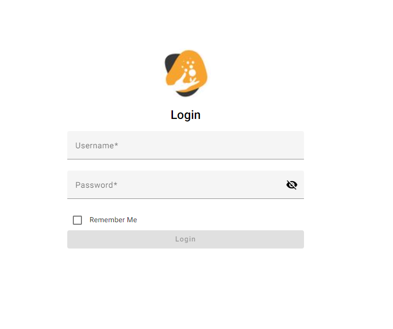

# InnovasystUserManagement

<a name="readme-top"></a>

<!-- PROJECT LOGO -->
<div align="center">
  

  <h3 align="center">Innovasyst Users Management</h3>

  <p align="center">
    <a href="https://fcruz530.github.io/Innovasys-User-Management/" target="_blank">View Demo</a>
  </p>
</div>


<!-- TABLE OF CONTENTS -->
<details>
  <summary>Table of Contents</summary>
  <ol>
    <li><a href="#about-the-project">About The Project</a></li>
    <li><a href="#usage">Usage</a></li>
    <li><a href="#api-resources">API Resources</a></li>
    <li><a href="#built-with">Built with</a></li>
    <li><a href="#prerequisites">Prerequisites</a></li>
    <li><a href="#installation">Installation</a></li>
    <li><a href="#contact">Contact</a></li>
  </ol>
</details>

<!-- ABOUT THE PROJECT -->
## About The Project



This project is an assesment and was developed as part of an application process with a software consulting services company
called InnovaSyst, wich is a company based in PR. 

_For more information about the company, please refer to their [Website](https://innovasyst.com/)_

The project consists of an application, built with the purpose of having a place to manage users
as part of Innovasyst Administration as a central repository, and will allow administrators to perform many operations
such as adding new users, updating and removing them.

<p align="right">(<a href="#readme-top">back to top</a>)</p>

## Usage

- When starting the application, you will be navigated to a login form that will require 
you to authenticate yourself with a username and password. To sign in, you must authenticate with these 
hardcoded credentials.

Username: admin@innovasys.com
Password: 5SB^7yCKz2GbBzsk

** NOTE: Authentication process is simulated in memory. No API or other related are involved.

- After authentication, you will be navigated to a page that will display a list of all users registered
in the system. By default, it will display 5 users per page and it is allowed to change it to 10 if desired.

- When clicking the Add User button, a form will be displayed to provide basic information such as the name
and gender before adding it to the system.

- Other operations can be performed, such as deleting a user, or updating the information of a specific user.

<p align="right">(<a href="#readme-top">back to top</a>)</p>

## API Resources

The following resource were used for prototyping and testing purposes to accomplish 
with simulating a user management system

https://gorest.co.in/public/v2/users

_For more information about this resources, please refer to their [Website](https://gorest.co.in/)_

### Built With

* [![Angular][Angular.io]][Angular-url]

<p align="right">(<a href="#readme-top">back to top</a>)</p>

### Prerequisites
- Angular (Core Libraries) v16.2.12
- Typescript >=4.9.3 <5.2.0
- Angular CLI 16.2.9
- Node ^16.14.0 || ^18.10.0

### Installation

1. Clone the repo
   ```sh
   git clone https://github.com/fcruz530/Innovasys-User-Management.git
   ```
2. Install NPM packages
   ```sh
   npm install
   ```
3. Run the application
   ```sh
   npm run start
   ```

<p align="right">(<a href="#readme-top">back to top</a>)</p>

<!-- CONTACT -->
## Contact

Felix J. Cruz Ortiz - javi78001@gmail.com


<p align="right">(<a href="#readme-top">back to top</a>)</p>
